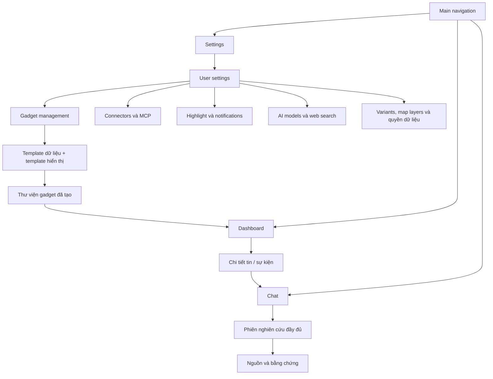
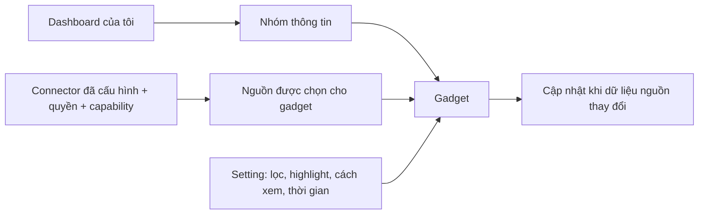
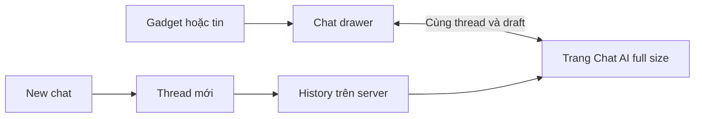
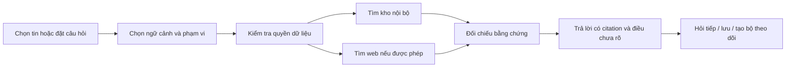
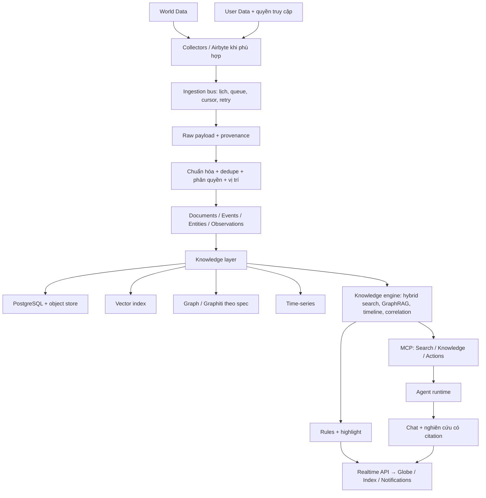

# Life Dashboard — đề xuất sản phẩm và UI/UX

Ngày: 2026-09-26. Trạng thái: **bản đề xuất để review**, chưa thay thế spec được phê duyệt, chưa phải kế hoạch thực thi. Bản minh họa: `life-dashboard-preview.html`; dữ liệu, chat và cập nhật trong đó đều là mô phỏng.

**Design system được chọn:** [shadcn/ui + Recharts, theme và i18n](../DESIGN_SYSTEM.md). Toàn bộ UI production theo shadcn; chart cổ phiếu/coin dùng Recharts. Skill áp dụng: `.agents/skills/bbd-os-ui-system/SKILL.md`. Bản HTML cũ là minh họa luồng, chưa phải source shadcn/Recharts được tích hợp.

## 1. Mục tiêu và tiêu chí thành công

Xây dashboard cá nhân, self-hosted, tự thu thập World Data và kết nối User Data theo quyền. Người dùng có thể:

1. Mở trang chủ và hiểu điều gì mới, xảy ra ở đâu, điều gì liên quan đến mình.
2. Thiết lập chủ đề, vùng, thực thể, tài sản hoặc phần mềm theo dõi; hiểu vì sao một tin được highlight.
3. Chọn tin/sự kiện → đọc nguồn và diễn biến → hỏi sâu bằng chatbot có tìm kiếm web và trích dẫn.
4. Tìm lại dữ liệu đã thu thập, đối chiếu nguồn và sử dụng ngữ cảnh cá nhân đã cho phép.
5. Biết nguồn nào đang hoạt động, cập nhật chậm, thiếu quyền hoặc mất kết nối.
6. Tự tạo dashboard và nhóm thông tin, thêm/sắp xếp/đổi kích thước gadget, chọn dữ liệu từ **các connector đã cấu hình**. Đây là yêu cầu cốt lõi được người dùng bổ sung.

Giả định để đề xuất: một chủ sở hữu; giao diện tiếng Việt, nội dung đa ngôn ngữ; desktop là trải nghiệm đầy đủ, mobile ưu tiên đọc và tra cứu. Trang index mặc định nằm sau đăng nhập. Chế độ chia sẻ công khai, nếu cần, chỉ dùng World Data được phép công bố lại và phải có thiết lập riêng.

## 2. Các phương án bố cục

| Phương án | Điểm mạnh | Đánh đổi |
| --- | --- | --- |
| Globe chiếm gần toàn màn hình | Quan sát diễn biến địa lý tốt | Tin không có địa điểm và nhu cầu cá nhân khó nổi bật |
| Feed và widget làm trang chủ | Đọc nhanh, phù hợp mobile | Yếu hơn về cảm nhận tình hình toàn cầu |
| **Kết hợp: globe + highlight + index riêng** | Giữ tổng quan địa lý và khả năng đọc/tra cứu đầy đủ | Cần giới hạn số panel mặc định |

**Khuyến nghị dashboard động, kèm template kết hợp để bắt đầu.** Globe, feed, highlight và các widget đều là gadget có thể thêm/gỡ hoặc cấu hình. Template mặc định có globe và danh sách liên quan; người dùng có thể chuyển sang dashboard hoàn toàn theo nhóm công việc, nghiên cứu hoặc đời sống. Không bắt buộc giữ bố cục globe trung tâm.

Tham khảo World Monitor về quan sát thế giới và lớp dữ liệu; GOIES về liên kết sự kiện, thực thể và nghiên cứu. Thiết kế này dùng chung workflow từ thu thập đến nguồn trích dẫn, không sao chép toàn bộ UI của hai dự án.

## 3. Sơ đồ màn hình



**Main navigation chỉ có Dashboard / Chat / Settings.** Toàn bộ cấu hình nằm trong **Settings → User settings**. Dòng tin, tri thức, timeline, dữ liệu cá nhân và chi tiết nguồn được mở từ gadget/kết quả chat khi cần; không có mục main navigation riêng. Dashboard giữ điều khiển vận hành như thời gian, chọn view và Edit/Save/Cancel. Cấu hình nguồn, template, model, rule được mở ở Settings. Chat có drawer và trang đầy đủ dùng chung thread/history.

## 4. Toàn bộ màn hình và hành vi

### 4.0. Settings → User settings → Gadget management

Đây là nơi **tạo và quản lý định nghĩa gadget**. Dashboard Edit chỉ thêm một gadget đã tạo vào nhóm, điều chỉnh vị trí/kích thước hoặc gỡ khỏi layout. Gỡ khỏi dashboard không xóa định nghĩa gadget hay dữ liệu. Sửa định nghĩa trong Settings có preview, liệt kê các dashboard sử dụng và lưu version; layout đang mở không bị đổi tọa độ. Xóa định nghĩa đang được sử dụng phải nêu rõ ảnh hưởng.

Mỗi gadget có hai lựa chọn riêng:

1. **Template dữ liệu:** World Data (hiểu “word data” theo ngữ cảnh là World Data), connector đã cấu hình, hoặc MCP server/tool/resource đã cấu hình và cấp quyền. Connector chịu trách nhiệm auth/sync/provenance; MCP là giao thức truy cập công cụ/tài nguyên, không mặc nhiên là một feed hoặc được polling mọi tool.
2. **Template hiển thị:** video/stream, text/AI brief, table, Telegram channel, news feed, chart/radar, globe/flat map, timeline hoặc bảng tín hiệu tương quan. Hiểu “tvideo” là video. Template chỉ cho chọn nguồn có dữ liệu tương thích; Telegram cần channel scope, video cần media URL/provider phù hợp, chart cần số/đơn vị/thời gian, map cần geometry/vị trí.

Luồng tạo: chọn template dữ liệu → chọn connector/MCP instance đã cấu hình → chọn template hiển thị tương thích → scope/filter/highlight → preview → đặt tên và lưu vào thư viện. Sau đó Dashboard → Edit → Add gadget → chọn gadget trong thư viện → bố trí → Save.

Không tự gọi tool MCP có tác dụng ghi để refresh gadget. Chỉ tool/resource đọc được cấp quyền, có schema đầu ra phù hợp mới được dùng; có timeout, quota và cache. Không lưu secrets trong gadget config hoặc cho chạy JavaScript tùy ý từ template. Video/embed có allowlist và xử lý URL an toàn; nội dung news/text/chat cần sanitize.

Các mục User settings:

- Gadget management: thư viện đã tạo, template catalog, preview, sửa/nhân bản/xóa và nơi sử dụng.
- Data connectors: World Data và nguồn cá nhân, credential/scope, lịch sync, quota, health.
- MCP: server, transport/auth, tool/resource được phép, chế độ đọc và giới hạn.
- Topics/highlights/notifications: watchlists, exclusions, rule, digest và giờ yên lặng.
- Map layers & country intelligence: shared layer catalog, nguồn/công thức/version của từng chỉ số.
- AI & Chat: kết nối OpenAI SDK qua Ommi Router theo cấu hình hệ thống hiện có; web search, budget và retention history. Cấu hình routing/provider/model do Ommi Router quản lý; không dựng bộ quản lý provider thứ hai trong BBD-OS.
- Appearance & variants: ngôn ngữ, timezone, đơn vị, layout mobile, preset world/tech/finance/commodity/happy/energy.
- Appearance & language mở **shadcn Dialog**: Light / Dark / System và English (US) / Tiếng Việt. Lựa chọn locale của app là `en-us` / `vi-vi`, map sang `en-US` / `vi-VN` cho Intl/HTML. Preview ngay; Save lưu cả hai, Cancel/close khôi phục; áp dụng cho toàn bộ UI và portal, không tự dịch tin hoặc đổi tiền tệ/timezone.
- Privacy & storage: quyền cá nhân, egress, retention, xuất/xóa, backup và nhật ký truy cập.

#### Panel inventory và feature catalog phải có

| Nhóm | Panel/gadget cụ thể | Cấu hình và hành vi |
| --- | --- | --- |
| Curated news | Global/regional feed, AI news brief | Category/region/language/source; gộp trùng; brief có citation, khung thời gian và nhãn AI |
| Dual map engine | Globe 3D bằng **globe.gl**, flat map WebGL bằng **deck.gl** | Dùng chung layer IDs/catalog, filters, selected event và time window; chuyển engine giữ ngữ cảnh; layer không hỗ trợ có thông báo |
| Media/text | Video, text/brief, table, Telegram channel, news feeds | Render đúng schema, permission và policy của nguồn; loading/empty/stale/error riêng |
| Cross-stream correlation | Signal convergence, timeline và evidence list | Military/economic/disaster/escalation; liên kết theo vùng/thời gian/entity; hiện căn cứ và độ bất định, không coi correlation là nhân quả |
| Country Instability Index | CII v8 country table, bands, movement, map layer | Mục tiêu theo yêu cầu: 31 Tier-1 countries, score/band/live freshness và biến động xấp xỉ 24h |
| Finance radar | Stock exchanges, commodities, crypto, market composite | Chart dùng Recharts qua shadcn Chart; provider, session, currency/unit, timestamp, delay; composite công bố thành phần/trọng số/phương pháp |
| AI qua Ommi Router | Brief, chat và các enrichment dùng model | OpenAI SDK phía server, dùng cấu hình kết nối/router hiện có; không hỗ trợ local AI |
| Site variants | world, tech, finance, commodity, happy, energy | Preset từ cùng codebase: catalog/category/layer/rules/default layout; cho cá nhân hóa sau khi áp preset |

Panel inventory phải là danh sách implementation cụ thể với template ID/version, input schema/capabilities, renderers hỗ trợ, source requirements, trạng thái đã triển khai và variants dùng nó. Một card trong catalog chưa có implementation phải ghi rõ trạng thái, không coi là tính năng đã hoạt động.

**CII v8:** tham chiếu yêu cầu tại https://www.worldmonitor.app/country-instability-index/ . Trước khi tích hợp phải chốt revision, danh sách 31 quốc gia, nguồn đầu vào, công thức/trọng số/bands và cách tính movement theo phương pháp v8. Nếu dùng provider cần quyền truy cập; nếu port thuật toán phải tuân thủ license của source. Giữ method version và coverage; thiếu dữ liệu thì hiện unavailable/stale, không tự tạo điểm hoặc gọi một công thức khác là CII v8. Đây là chỉ số mô hình hóa, không phải xác nhận chắc chắn tình hình quốc gia.

**AI đã chốt:** chỉ dùng OpenAI SDK để kết nối Ommi Router theo cấu hình hệ thống người dùng đã có. Backend giữ base URL, credential và model alias theo integration hiện hành; không đưa key vào browser. Lúc triển khai phải xác nhận API contract mà router hỗ trợ cho streaming, tool calls, embeddings và cancellation; không mặc nhiên coi mọi endpoint OpenAI đều được router hỗ trợ. Không triển khai Ollama/local model/download model hay fallback local AI. Router lỗi thì báo lỗi và cho retry, không tự chuyển sang provider ngoài cấu hình.

**Variants:** đổi preset có preview trước khi áp vào dashboard và không xóa layout tùy chỉnh im lặng. Dùng chung collectors, models, components và chat runtime; không fork sáu ứng dụng. Happy ưu tiên các nhóm tin tích cực do người dùng chọn nhưng không làm thay đổi nội dung/bằng chứng của tin gốc.

Các engine/panel trong catalog là yêu cầu production. Globe trong mockup hiện là D3/canvas minh họa; chưa phải implementation globe.gl/deck.gl. Không đánh đồng brief/correlation/CII mẫu với kết quả dữ liệu thật.

### 4.1. Tổng quan thế giới — trang chủ/index

#### Dashboard → Group → Gadget → Connector đã cấu hình



- Nhiều dashboard, ví dụ “Tổng quan”, “AI & công việc”, “Tài chính”, “Cuộc sống”. Mỗi dashboard chứa nhiều group người dùng đặt tên; group chứa gadget độc lập.
- **Layout đã chốt theo yêu cầu người dùng:** lưới đơn vị ô vuông, tối đa **20 cột**; gadget là hình chữ nhật chiếm số ô nguyên. Chiều dọc tăng theo số hàng và dùng scroll của trình duyệt, không giới hạn bằng chiều cao viewport. Group là vùng gom gadget trên cùng hệ lưới.
- Lưu vị trí/kích thước theo `x, y, w, h`: `0 <= x`, `1 <= w <= 20`, `x + w <= 20`, `y >= 0`, `h >= 1`. Min width/height cụ thể tùy loại gadget để nội dung đọc được. Một ô có cạnh `(usableWidth - 19 * gap) / 20`; gadget rộng `w * cell + (w - 1) * gap`, cao tương tự với `h`. Padding nằm ngoài usableWidth.
- Kéo bằng thanh tiêu đề; preview vị trí thả, snap theo ô, không chồng lấn. Khi thả vào vùng đã chiếm, dồn gadget bị ảnh hưởng xuống dưới; giữ thứ tự và có Undo. Resize theo cạnh/góc, snap ô; tăng số hàng khi cần. Khi đang chỉnh layout, tin mới không tự đổi kích thước hoặc xê dịch gadget.
- Mobile đề xuất layout riêng cũng không vượt 20 cột, mặc định gadget rộng đủ vùng và xếp dọc; không ép bố cục desktop thành chữ quá nhỏ. Nội dung dài có “Xem thêm”; dashboard cuộn theo trang. Chat drawer có vùng cuộn hội thoại riêng.
- Chế độ **Xem** tập trung đọc; chế độ **Chỉnh sửa** cho kéo/thả, đổi kích thước theo lưới, di chuyển giữa nhóm, đổi tên, nhân bản và gỡ gadget. Có thao tác bàn phím di chuyển lên/xuống/chuyển nhóm. Group có thu gọn, đổi thứ tự và xóa sau khi nêu rõ những gadget bên trong.
- **View mặc định:** ẩn grid, thước ô và các điều khiển bố cục. **Edit:** tạo bản nháp, hiện grid và cho thêm/gỡ/di chuyển/resize/cấu hình gadget. **Save:** lưu nguyên tử layout cùng gadget settings; server xác nhận thành công mới thoát Edit. **Cancel:** bỏ bản nháp và khôi phục layout đã lưu. Không tự lưu layout. Lưu lỗi giữ bản nháp để thử lại; rời trang với thay đổi chưa lưu cần cảnh báo.
- Mobile reflow không ghi đè tọa độ desktop khi đổi viewport. Gỡ gadget không xóa dữ liệu/connector. Backend kiểm tra quyền, giới hạn lưới và layout version để tránh tab cũ ghi đè thay đổi mới.
- **Viewport:** html/body/app root rộng 100%, không margin mặc định, không max-width đóng khung ứng dụng; chiều cao tối thiểu phủ viewport (`min-height: 100dvh` có fallback). Dashboard dài thì document cuộn dọc, không khóa body bằng `height: 100vh; overflow: hidden`. Mobile hỗ trợ safe-area, bàn phím ảo, menu thu gọn và thao tác vị trí/kích thước thay thế kéo thả. Chat toàn trang có shell phủ viewport với vùng hội thoại cuộn riêng, composer không bị bàn phím che.
- Bộ lọc mặc định theo thứ tự dashboard → group → gadget; gadget ghi đè có badge giải thích phạm vi khác nhau. Không âm thầm áp bộ lọc địa lý vào dữ liệu không hỗ trợ.

**Luồng tạo gadget:** Settings → User settings → Gadget management → template dữ liệu → nguồn đã cấu hình → template UI → scope/filter/highlight → preview → lưu thư viện. **Luồng thêm vào dashboard:** Edit → Thêm gadget → chọn trong thư viện → nhóm/vị trí/kích thước → Save. Trong Edit chỉ sửa layout; sửa nguồn/rule/template trở về User settings.

| Cấu hình gadget | Lựa chọn |
| --- | --- |
| Nguồn | Connector instance đã cấu hình, có tên tài khoản/kênh/feed/repo |
| Phạm vi | Feed, channel, subreddit, vùng, mã thị trường, repository hoặc folder được phép |
| Lọc | Chủ đề/từ khóa, thực thể, vùng, ngôn ngữ, loại trừ, thời gian |
| Hiển thị | List/cards/table/chart/globe tùy dữ liệu; số mục, cột và đơn vị |
| Highlight | Rule đã lưu hoặc rule riêng gadget; hiện lý do khớp |
| Cập nhật | Tự cập nhật từ collector hoặc tạm dừng hiển thị; không vượt khả năng nguồn |
| Chat | “Hỏi về gadget này” đính kèm tập dữ liệu, bộ lọc và thời gian đang xem |

**Gadget catalog:** globe/bản đồ sự kiện; unified feed; highlight; thị trường/watchlist giá; macro/time-series; weather/cảnh báo thiên tai; CVE/advisories; research/releases; timeline; saved search; personal agenda/notes khi có connector và quyền. Gadget chỉ cung cấp kiểu biểu diễn phù hợp khả năng nguồn. Không có connector phù hợp thì hiện lý do và đường dẫn cấu hình nguồn.

Ví dụ dashboard “Của tôi”:

```text
Nhóm AI & công việc
  ├ Tin AI              ← RSS/Google News đã cấu hình + rule AI
  ├ Paper mới           ← arXiv đã cấu hình
  ├ Release tôi theo dõi ← GitHub connector + danh sách repo
  └ CVE liên quan       ← Advisory/CVE + phần mềm theo dõi
Nhóm Thị trường
  ├ Watchlist giá       ← Provider finance đã cấu hình + mã đã chọn
  └ Tin vĩ mô           ← Macro/Gov/RSS đã cấu hình
Nhóm Cuộc sống
  ├ Thời tiết địa phương← Weather connector + địa điểm
  └ Lịch hôm nay        ← Calendar đã cấp quyền
```

Nguồn bị ngắt/lỗi: giữ gadget, thông báo nguồn bị ảnh hưởng và last update; nguồn còn hoạt động vẫn cập nhật nếu gadget tổng hợp nhiều nguồn. Không tự đổi sang connector khác. Backend kiểm tra source instance, scope và capability mỗi lần truy xuất; lọc dropdown chỉ hỗ trợ UX.

#### Các gadget trong template tổng quan

- Globe canvas/WebGL 3D, chuyển 2D, zoom tới vùng, chọn marker/cụm sự kiện; danh sách tương đương cho người dùng bàn phím.
- Lớp: News/Social, Finance, Weather/Disaster/Climate, OSINT/Cyber, Research/Technology; traffic theo vùng có dữ liệu.
- Lọc thời gian, vùng, chủ đề, nguồn; bật riêng các lớp tránh che lẫn nhau. Có nút đặt lại và tên view hiện tại.
- Marker thể hiện vị trí sự kiện, không lấy vị trí tòa soạn thay cho vị trí xảy ra. Vị trí suy luận hoặc chỉ ở mức quốc gia có nhãn độ chính xác; không đặt điểm giả cho tin thiếu vị trí.
- Cạnh globe: tin/sự kiện liên quan nhất, lý do highlight, nguồn, thời điểm, trạng thái đã đọc/lưu.
- Phía dưới: widget đã chọn và ngữ cảnh cá nhân được phép. Có thể ẩn hoàn toàn dữ liệu cá nhân khi trình chiếu.
- Luồng trực tiếp có pause/resume; khi đang đọc không tự đổi vị trí bài. Hiện “Có N cập nhật mới”, người dùng đưa vào luồng khi sẵn sàng.
- Chế độ xem lịch sử chọn mốc thời gian và không mang nhãn Live. Dữ liệu hết hạn hoặc bị nguồn sửa vẫn có lịch sử phù hợp chính sách lưu trữ.

Khung desktop:

```text
┌ Tìm kiếm ─ View: Thế giới của tôi ─ Nguồn ─ Thông báo ─ Hỏi trợ lý ┐
│ Menu   │ Vùng / thời gian / chủ đề / lớp dữ liệu                    │
│        ├──────────────────────────────────┬────────────────────────┤
│        │                                  │ Đáng chú ý với bạn     │
│        │       GLOBE 3D / BẢN ĐỒ 2D       │ Tiêu đề + lý do khớp   │
│        │                                  │ Nguồn + thời điểm      │
│        ├──────────────────────────────────┴────────────────────────┤
│        │ Widget theo dõi: thị trường / thời tiết / nghiên cứu      │
│        │ Ngữ cảnh cá nhân khi được bật                             │
└────────┴──────────────────────────────────────────────────────────┘
```

### 4.2. Dòng tin — nội dung gadget và màn hình mở rộng

- Chứa cả dữ liệu có và không có địa lý. Tìm từ khóa hoặc ý nghĩa; bộ lọc nguồn, ngôn ngữ, loại, thời gian, vùng, thực thể, đã đọc/lưu và highlight.
- Hai cách nhóm: từng tài liệu và cụm sự kiện. Gộp bài trùng nhưng vẫn mở được từng nguồn; số lượng bài đăng lại không được coi là số nguồn xác nhận độc lập.
- Mỗi hàng: tiêu đề, tóm tắt ngắn, nguồn, published/updated/collected time, loại dữ liệu, lý do liên quan. Nhãn AI nếu tóm tắt được tạo bởi model.
- Sắp xếp mới nhất hoặc liên quan nhất; lưu view; đánh dấu đọc, bookmark, ẩn bài/nguồn và “không liên quan” để điều chỉnh setting.
- Nội dung tiếng Việt hoặc bản gốc; bản dịch gắn nhãn và luôn giữ đường dẫn tới bản gốc.

### 4.3. Chi tiết tin / sự kiện

Panel mở ngay từ globe/feed, có URL để mở thành trang đầy đủ:

1. Chuyện gì, ở đâu, khi nào; nguồn gốc, mức độ xác định vị trí.
2. Vì sao được highlight: rule nào, từ khóa/thực thể/vùng nào khớp.
3. Timeline: phát hiện đầu tiên, bài bổ sung, cập nhật và đính chính.
4. Nguồn và đoạn bằng chứng; tách nguồn trực tiếp, bài tổng hợp, nội dung bình luận.
5. Quan hệ với sự kiện/thực thể khác; phân biệt quan hệ được nguồn xác nhận và suy luận.
6. Báo cáo mâu thuẫn hoặc chưa đủ bằng chứng; không biến điểm xếp hạng thành xác suất đúng.
7. Hành động: lưu, theo dõi thực thể/chủ đề, tạo rule, hỏi sâu, mở nguồn gốc.

### 4.4. Theo dõi / highlight / thông báo

Rule builder dễ hiểu: “Theo dõi điều gì?” → “Ở đâu?” → “Từ nguồn nào?” → “Loại trừ gì?” → “Hiển thị/thông báo thế nào?”.

- Điều kiện: từ khóa, semantic topic, người/tổ chức, mã cổ phiếu/coin, repository, sản phẩm/phần mềm, CVE, quốc gia/vùng; các điều kiện dùng AND/OR được hiển thị rõ.
- Exclusion, ngôn ngữ, mức quan trọng, thời hạn rule, nguồn cho phép/chặn.
- Có preview trên dữ liệu đã có trước khi lưu; giải thích rule khớp và tình huống không khớp.
- **Highlight** thay đổi độ nổi bật trên UI; **notification** gửi tới trung tâm thông báo hoặc kênh đã bật. Hai lựa chọn riêng.
- Digest theo lịch, cảnh báo khi đạt ngưỡng, cooldown, gộp trùng, snooze, giờ yên lặng và múi giờ.
- Ngưỡng domain rõ ràng: giá thay đổi bao nhiêu phần trăm trong cửa sổ nào; CVE liên quan phiên bản nào; weather alert trong vùng và khoảng hiệu lực nào.
- Không tự tăng ưu tiên chỉ vì bài có lượng tương tác cao. Người dùng có thể sửa/xóa rule và xem lịch sử thông báo.

Ví dụ: “AI + nguồn arXiv/Hugging Face/GitHub → highlight”; “CVE ảnh hưởng phần mềm theo dõi → thông báo”; “Cảnh báo thời tiết tại địa điểm trong lịch được phép dùng → đánh dấu liên quan chuyến đi”.

### 4.5. Chat và nghiên cứu sâu

#### Quyết định: port source chat từ AnythingLLM vào drawer

Yêu cầu người dùng: dùng drawer và port phần chat AnythingLLM. Đã đọc source upstream tại commit `128a01575a50f0284aeca75a93399b6fb1db0328`; LICENSE tại commit này là MIT (Copyright Mintplex Labs Inc.). Đây là khảo sát để chốt phạm vi port, chưa có code AnythingLLM được tích hợp vào sản phẩm.

**Cách tích hợp đã xác nhận:** clone upstream tại revision được ghi nhận, port source chat cùng dependency cần dùng vào bộ source BBD-OS, build và bảo trì cùng dự án. Không dùng iframe hoặc ứng dụng AnythingLLM bên ngoài. Giữ copyright/license notice, ghi đường dẫn nguồn và các thay đổi. Có bản clone tham khảo chưa có nghĩa đã port xong.

| Phần source upstream | Cách đưa vào BBD-OS |
| --- | --- |
| `frontend/src/components/WorkspaceChat/index.jsx` | Tách phần nạp history/context khỏi điều hướng workspace, đặt trong drawer dùng chung |
| `WorkspaceChat/ChatContainer/index.jsx` | Port state hội thoại, gửi/nhận và trạng thái generation; map thread/context sang BBD-OS |
| `ChatContainer/PromptInput/` | Port composer, gửi/dừng, draft; drawer giữ tối giản, các control bổ sung chỉ trên trang Chat |
| `ChatContainer/ChatHistory/`, `Citation/` | Port message renderer/actions và citation; giữ liên kết bằng chứng BBD-OS |
| `ChatContainer/SourcesSidebar/`, `ChatSidebar/` | Tích hợp trên trang Chat đầy đủ; drawer không có sidebar/tab nguồn/ngữ cảnh |
| `frontend/src/models/workspace.js`, `workspaceThread.js` | Map history/thread/stream/cancel sang API BBD-OS; upstream stream dùng fetch-event-source và abort |
| `frontend/src/utils/chat/` | Audit message events, Markdown/sanitize và agent events khi port; không đưa HTML chưa làm sạch vào UI |

Frontend upstream có `react-router-dom`, các context riêng, event listeners trên window, workspace models và styling riêng; BBD-OS đang dùng Next.js/TypeScript. Vì vậy phải port phần source cùng các dependency cần thiết, chuyển routing và contract ở biên, quản lý cleanup listener khi drawer đóng/mở, và lưu lại upstream commit/license/notice để bảo trì. Không thể chép một component rồi tuyên bố toàn bộ chat đã hoạt động.

**Drawer đã chốt theo yêu cầu mới:** drawer lớn bên phải, tham khảo [MUI right temporary drawer](https://mui.com/material-ui/react-drawer/). Desktop đề xuất rộng khoảng 60–70% viewport với giới hạn đọc thoải mái; mobile phủ đủ chiều rộng. Chỉ có **New chat**, **danh sách tin nhắn user/assistant**, **ô nhập với gửi/dừng**, và nút đóng. Header không có model/thread selector, History, attachment, web-search toggle, tab nguồn, chip ngữ cảnh hoặc nút mở rộng. Citation có thể nằm trong nội dung câu trả lời. Các công cụ và quản lý hội thoại nằm ở trang Chat riêng.

Drawer production dùng **shadcn Sheet** neo mép phải, cao viewport, có backdrop, focus management, Esc/close và trả focus về nút mở. Vùng tin nhắn cuộn, composer giữ dưới cùng và thích ứng bàn phím mobile. Đóng drawer giữ thread/draft; không đồng nghĩa xóa hoặc gửi lại câu hỏi. Link MUI chỉ tham khảo hành vi; thư viện component được chọn là shadcn/ui, không cài Material UI.

Các hành vi chat port cần có trong phạm vi nghiệm thu: nhiều lượt/thread và history, streaming + stop, Markdown/code có sanitize, citation mở đúng bằng chứng, copy/edit/regenerate theo contract, tool/web-search status, attachment có quyền nếu bật. TTS/STT và công cụ chuyên biệt upstream là phạm vi mở rộng nếu được chọn; không mặc nhiên kéo cả backend/agent stack AnythingLLM vào BBD-OS.

**History, New chat và trang Chat AI riêng là phạm vi bắt buộc:**

- Trang Chat AI full size có route riêng cùng thread ID để refresh/deep link. Truy cập bằng mục **Chat** trên main navigation; mở lại đúng thread đang dùng trong drawer, không cần nút chuyển màn hình nằm trong drawer.
- Drawer và trang đầy đủ dùng chung thread/message store và backend API. Chuyển cách xem không tạo thread mới, mất draft/attachment/context hoặc khởi động lại generation.
- New chat tạo hội thoại riêng. History có tiêu đề, thời điểm cập nhật, tìm kiếm/phân trang và mở lại đúng hội thoại; mở History không gửi lại câu hỏi. Đổi tên/xóa có trạng thái phù hợp.
- History production lưu trên server theo chủ sở hữu, tồn tại sau reload/đăng nhập lại; giữ messages, citations, context và trạng thái theo retention. Không chỉ dùng state component/localStorage.
- History chỉ nằm trên trang Chat. Mobile mở history qua menu của trang Chat rồi chọn thread. Kiểm tra lại quyền khi mở nguồn cá nhân đã lưu, kể cả nguồn vừa bị thu hồi.



Web search, RAG, GraphRAG và consent vẫn đi qua knowledge/tools/runtime của BBD-OS. Drawer có thể nhận context snapshot với source IDs, bộ lọc, thời gian và selected record IDs; không gửi toàn bộ dữ liệu dashboard mỗi lần hỏi. Nếu thao tác thay đổi dữ liệu cá nhân hoặc hành động bên ngoài, giữ approval và audit hiện có.

- Mở từ một sự kiện, một tập kết quả, thực thể hoặc câu hỏi tự do. Trang Chat có phần xem/chỉnh ngữ cảnh; drawer giữ tối giản. Khi mở từ gadget/tin, ngữ cảnh có thể được nêu trong tin nhắn mở đầu để người dùng hiểu câu hỏi đang gắn với dữ liệu nào.
- Phạm vi: kho đã thu thập; kho + web; thêm nguồn cá nhân đã cấp quyền. Không tự coi bật web là cho phép gửi nội dung cá nhân ra ngoài.
- Trước lúc dùng dịch vụ ngoài, phân biệt quyền gửi truy vấn tới search provider và quyền gửi đoạn dữ liệu tới model qua Ommi Router. Dữ liệu riêng vẫn phải tuân theo policy đã cấp; tác vụ cần xem/sửa/cho phép bổ sung được xử lý trên trang Chat, không tự vượt quyền vì drawer tối giản.
- Hiển thị tiến độ: tìm trong kho → tìm web → đọc nguồn → đối chiếu → tổng hợp. Có hủy tác vụ, giới hạn thời gian/nguồn/chi phí và xử lý provider lỗi.
- Kết quả: trả lời trực tiếp, nguồn gắn vào nhận định, thời điểm bằng chứng, phần suy luận và phần chưa biết. Citation mở đúng nguồn/đoạn hỗ trợ; không chỉ là danh sách URL cuối bài.
- Khi kho và web mâu thuẫn, trình bày hai nguồn và thời điểm; không tự chọn một bên mà không có căn cứ.
- Lưu phiên nghiên cứu, bookmark bằng chứng, tạo ghi chú hoặc bộ theo dõi từ kết quả. Không tự đưa mọi kết quả web vào kho dài hạn nếu chưa bật quy tắc lưu.
- Research agent là vai trò đầu tiên. Financial/Health/Travel/Work/Learning/Personal/Home agent dùng cùng runtime, quyền và công cụ với prompt/chuyên môn phù hợp.
- Hành động có tác dụng bên ngoài như gửi thư, ghi lịch, giao dịch hoặc điều khiển IoT có bản xem trước và quyền riêng; chế độ đọc/phân tích không mặc nhiên cấp quyền hành động.



### 4.6. Tri thức — mở từ gadget hoặc kết quả chat

- Tìm Documents / Events / Entities; mở trang thực thể với aliases, nguồn, timeline, quan hệ và dữ liệu liên quan.
- Graph chỉ mở khi cần khám phá quan hệ; có danh sách tương đương, giới hạn phạm vi để tránh đồ thị không đọc được.
- Các cạnh có loại quan hệ, nguồn, thời gian hiệu lực và nhãn xác nhận/suy luận.
- Entity resolution giữ lịch sử merge/split/correction; không trộn các tổ chức/người cùng tên mà mất provenance.
- Timeline và event correlation hỗ trợ câu hỏi “đã thay đổi gì?” và “có những liên hệ nào?”. Correlation không tự chứng minh quan hệ nhân quả.
- Memory của trợ lý có UI để xem/sửa/xóa, tách khỏi bằng chứng nguồn.

### 4.7. Cá nhân hôm nay — gadget và cấu hình trong User settings

- Lịch sắp tới, việc/ghi chú cần chú ý, thông tin thế giới liên quan công việc/chuyến đi/repo/tài sản đã theo dõi.
- Inbox riêng và tìm kiếm trong Gmail, Drive, Notes, Browser, GitHub theo scope được cấp.
- Health và Finance cá nhân có provider/import cụ thể, đơn vị và thời gian dữ liệu; quyền kết nối riêng. Không gộp dữ liệu ngân hàng với watchlist thị trường.
- IoT hiển thị trạng thái từ thiết bị/provider đã kết nối; mỗi hành động điều khiển phải có quyền và xác nhận theo mức rủi ro.
- Có chức năng chọn phạm vi account/folder/calendar/repo, tạm ngừng, thu hồi quyền, xuất dữ liệu, xóa dữ liệu đã nhập. Xóa phải lan tới index/vector/graph/cache theo chính sách.
- Nội dung riêng mặc định không xuất hiện trong public/share view, không bị gửi vào web search, không trở thành dữ liệu World Data.

### 4.8. User settings → Data connectors

Catalog → chọn nguồn → xem điều kiện truy cập → cấp quyền/cấu hình → chọn scope và lịch → xem preview → kích hoạt → theo dõi đồng bộ.

Mỗi connector: trạng thái, last success, next run, freshness lag, số bản ghi mới/trùng/lỗi, phạm vi phủ, rate limit/quota, lần retry và thông báo hành động cần làm. Có pause/resume, retry và ngắt kết nối. Token được lưu an toàn và không hiển thị lại trong UI/log.

| Nhóm | Catalog đề xuất | Điều kiện/giới hạn hiển thị trong UI |
| --- | --- | --- |
| News | RSS/Atom, Google News RSS, GDELT, Gov APIs, báo chí Việt Nam | URL gốc; RSS ưu tiên; scraping chỉ ở nguồn cho phép; không vượt paywall |
| Social | Reddit, Hacker News, YouTube feeds, Telegram, Mastodon, Bluesky, X/Twitter | OAuth/API/provider và scope tùy nguồn; Telegram bot không đọc mọi kênh; transcript YouTube tùy quyền |
| Finance | Stocks, crypto, macro, lịch kinh tế | Provider, thị trường, tiền tệ, đơn vị, độ trễ và quyền dùng lại |
| Weather | Weather, climate, disaster, traffic | Phạm vi địa lý, độ mới, thời gian hiệu lực; traffic không mặc nhiên phủ toàn cầu |
| Cyber/Research | CVE/advisories, arXiv, Hugging Face, GitHub Releases | Phiên bản bị ảnh hưởng, paper/model/repo và quota |
| Personal | Gmail, Calendar, Drive, Browser, Health, Finance, Notes, GitHub, IoT | Connector/import cụ thể, phạm vi truy cập và quyền hành động riêng |

Toàn bộ catalog trên thuộc phạm vi sản phẩm đề xuất. Thứ tự triển khai theo nhóm không loại bỏ nguồn khỏi phạm vi. Trạng thái phải phân biệt “chưa có adapter”, “cần cấu hình”, “thiếu quyền”, “đang đồng bộ”, “sẵn sàng”, “lỗi”; có thẻ trong catalog không có nghĩa connector đã được triển khai.

### 4.9. Các mục User settings còn lại

- Trang mặc định, dark/light/system, mật độ, ngôn ngữ dịch, timezone, đơn vị, vùng mặc định, widgets và saved views.
- Thông báo, digest, giờ yên lặng; model/search provider và ngân sách nghiên cứu.
- Quản lý dashboard/group/gadget, template, layout và bộ lọc kế thừa; lưu cấu hình có version, xử lý được khi loại gadget không còn hỗ trợ.
- Chính sách giữ raw content, metadata, lịch sử; dung lượng, backup/restore và xuất/xóa dữ liệu.
- Consent theo source/tool, egress policy, nhật ký truy cập và hành động của agent; giới hạn tài nguyên cho collector và enrichment.
- Có trạng thái cấu hình thiếu và hướng dẫn xử lý; không hiển thị lựa chọn chưa có backend như thể đã hoạt động.

## 5. Onboarding và các trạng thái UX bắt buộc

Onboarding: chọn vùng/chủ đề → chọn nguồn công khai và nguồn cần credential → xem trước rule → mở dashboard. Kết nối dữ liệu cá nhân là bước tùy chọn, thực hiện từng nguồn.

| Trạng thái | Trải nghiệm |
| --- | --- |
| Chưa có nguồn | Nêu rõ chưa có dữ liệu, CTA thêm nguồn, tùy chọn xem demo có nhãn |
| Đang đồng bộ lần đầu | Tiến độ theo nguồn, hiện phần đã sẵn sàng, không spinner vô hạn |
| Không khớp bộ lọc | Giữ bộ lọc, chỉ rõ điều kiện, cho nới hoặc đặt lại |
| Nguồn chậm/lỗi/429 | Giữ dữ liệu cũ với nhãn stale; lần thành công cuối, lịch thử lại |
| Mất realtime | Nhãn mất kết nối, snapshot cuối; nối lại từ cursor và bù bản ghi thiếu |
| Tin mới khi đang đọc | Giữ vị trí, badge cập nhật mới; không nhảy feed hay mất lựa chọn |
| Nguồn sửa/rút bài | Cập nhật version, trạng thái và citation; không để bản cũ thành thông tin hiện hành |
| Không đủ bằng chứng | Nêu thiếu dữ kiện nào, đề xuất tìm tiếp; không tạo câu trả lời giả chắc chắn |
| Hết quota nghiên cứu | Hiển thị phần đã thu được, chi phí và lựa chọn tiếp tục có kiểm soát |
| Giảm chuyển động / máy yếu | Globe không tự xoay; dùng 2D/feed; không chặn thông tin nếu WebGL lỗi |

Mobile: feed/highlight trước, map mở khi cần; detail/chat toàn màn hình. Navigation gọn, target chạm tối thiểu khoảng 44px, không phụ thuộc hover. Desktop hỗ trợ bàn phím, focus rõ, Esc đóng panel và trả focus về phần tử mở, tương phản tốt, nhãn ngoài màu sắc, screen reader đọc danh sách thay canvas. Không đưa mọi cập nhật realtime vào live announcement.

## 6. Luồng dữ liệu và trách nhiệm các lớp



Các invariant cần giữ:

- Ingestion có dedupe/idempotency, retry/backoff/rate limit, checkpoint và dead-letter có khả năng xử lý lại; enqueue lại không tạo sự kiện trùng.
- Raw record lưu provenance và policy ngay từ đầu. Các bản derived, citations và indexes giữ liên kết đến version nguồn.
- Phân biệt tài liệu, sự kiện, thực thể và observation time-series. Mức giá hoặc quan sát thời tiết không bị ép thành một bài báo.
- `published_at`, `observed_at/event_time`, `collected_at`, `updated_at` có ý nghĩa khác nhau; timezone và đơn vị rõ ràng.
- Dữ liệu chuẩn hóa xuất hiện sớm; enrichment/entity linking/correlation chạy tiếp và gửi bản cập nhật. Không chặn toàn bộ dashboard chờ AI.
- Realtime UI có snapshot ban đầu, cursor/version, reconnect và catch-up. Push nhanh từ backend không biến nguồn polling chậm thành realtime thị trường.
- Gadget đọc dữ liệu chuẩn hóa qua API/subscription chung. Một connector thu thập một lần cho nhiều gadget; không tạo collector hoặc gọi provider riêng cho mỗi ô. Cấu hình gadget lưu source instance IDs, scope, query, rule và layout; không chứa credential hoặc code tùy ý. Backend kiểm tra quyền/capability kể cả với layout cũ.
- World/Personal phân tách bằng scope và quyền ở API, retrieval, indexes, graph traversal và tool execution; không dựa vào việc ẩn UI.
- Nội dung web/social là dữ liệu không tin cậy, không phải chỉ dẫn cho agent; HTML cần sanitize, URL collector cần kiểm soát SSRF và giới hạn tải.

Đây là kiến trúc logic, không bắt buộc mỗi hộp là một dịch vụ. Tiếp tục modular monolith và dùng hạ tầng sẵn có ở lớp đang sở hữu trách nhiệm. PostgreSQL có thể đảm nhiệm metadata và một phần indexing/time-series tùy yêu cầu; lựa chọn triển khai từng store cần được chốt trong spec kỹ thuật. Graphiti đang là yêu cầu của spec hiện hành: đề xuất này không tự loại bỏ hoặc thay thế nó. Airbyte và collector tự viết dùng nơi phù hợp, không bắt buộc chạy cả hai cho mọi nguồn.

## 7. Thứ tự triển khai đề xuất sau khi chốt thiết kế

Các đợt dưới đây là thứ tự bàn giao sản phẩm, chưa đánh lại số các Phase cũ:

| Đợt | Phạm vi | Điều kiện hoàn thành về code/build |
| --- | --- | --- |
| A — Chỉnh hướng | Map yêu cầu vào code hiện có; cập nhật spec/status/plan | Có ma trận đã có/thiếu/giữ lại; không mất nền tảng Phase 0–3 |
| B — Thu thập → dashboard động | Source registry, ingestion, chuẩn hóa, provenance, nguồn công khai đầu tiên, snapshot/realtime, dashboard/group/gadget settings, index + globe | Luồng production liền mạch tới UI; thêm gadget từ connector đã cấu hình, lưu/sắp xếp layout; build được; nguồn cần credential hiển thị đúng trạng thái |
| C — Cá nhân hóa | Watchlist, rules, highlight explainability, saved views, notifications | Rule được lưu và áp dụng vào dữ liệu mới; UI có preview và lý do |
| D — Hỏi sâu | Port AnythingLLM chat vào drawer, contextual chat, hybrid retrieval, web search, citations, quyền và budget | Source được port có provenance/license; API/stream/thread/cancel nối BBD-OS; câu hỏi đi qua dữ liệu được phép và trả nguồn |
| E — Mở rộng dữ liệu | Hoàn thiện các adapter News/Social/Finance/Weather/Cyber/Research trong catalog | Có source-specific settings, capability/health/quota; activation phụ thuộc quyền và provider |
| F — Personal + Knowledge | Personal connectors, entities, graph, timeline, correlation, memory và vai trò agent | Liên kết World/User Data theo quyền; hành động đi qua approval; không để graph chặn B–D |
| G — Test sau toàn bộ code | Contract/integration/E2E, quyền và egress, realtime reconnect, citation, tải và UX/a11y | Thực hiện ở giai đoạn kiểm thử riêng sau khi production code hoàn thành |

Trong giai đoạn code: chỉ code + build, không tạo/sửa/chạy test, lint hoặc standalone typecheck theo yêu cầu hiện tại. Build thành công chỉ xác nhận mức build; chưa chứng minh luồng chạy thực tế hoặc dữ liệu provider đúng. Test stage sẽ cung cấp bằng chứng hành vi trước tuyên bố sẵn sàng sử dụng.

Khi chuyển sang thực thi: báo trạng thái ngay khi xong mỗi task, commit theo phạm vi đã hoàn thành và bàn giao phase theo chỉ đạo Git của người dùng. Không gộp sửa đổi không liên quan hoặc đánh dấu phase xong chỉ dựa trên tài liệu.

## 8. Hồ sơ OSS và README khi hoàn thành

Khi hoàn tất code, repo phải có **`OSS_USED.md`** tổng hợp mọi OSS thực sự sử dụng, cùng hướng dẫn trong **README chính**. Đây là điều kiện bàn giao.

- Mỗi OSS ghi tên, URL upstream, version/commit, license/SPDX, vai trò, vị trí dùng/port, sửa đổi, nơi lưu license/copyright/NOTICE và cách cập nhật.
- Đối chiếu manifests/lockfiles, runtime services, thư viện frontend/backend, code ported/vendored, CDN, font/assets/map data. Bản xuất dependency inventory/SBOM có thể bao phủ dependency gián tiếp, với `OSS_USED.md` là điểm vào chung.
- Phân biệt đang dùng production, chỉ trong mockup và chỉ tham khảo; không ghi World Monitor/GOIES là dependency production khi chưa dùng code.
- README hướng dẫn setup/build/run, cấu hình connector/model/web search, View → Edit → Save/Cancel, chat drawer/full page/history, cấu trúc phần source port và liên kết `OSS_USED.md`.
- Hiện chưa có inventory hoàn chỉnh toàn repo. AnythingLLM chưa được clone/port trong công việc thiết kế này; clone và port thuộc task triển khai chat.

## 9. Phạm vi bản minh họa và quyết định cần review

Bản mẫu UI/UX duy nhất là **`life-dashboard-preview.html`**, gộp dashboard, Telegram gadget và mẫu giao diện/ngôn ngữ trước đây. Có đúng ba mục chính Dashboard/Chat/Settings, với User settings chứa Gadget management và cấu hình. Luồng minh họa: tạo gadget trong thư viện → Dashboard/Edit → chọn gadget → Save. Có View/Edit/Save/Cancel và History/New chat/trang Chat AI dùng chung hội thoại trong phiên. Save lưu layout, thư viện gadget và tùy chọn vào state minh họa khi host hỗ trợ; chưa có backend/database history. Khung xem inline không đại diện kích thước viewport ứng dụng production.

Dialog User settings có Light/Dark/System và EN/VI, xem trước và Save/Cancel. Theme dùng chung toàn bộ mẫu; dialog, Telegram gadget và bảng giá minh họa dùng cùng locale/định dạng số. Một số nội dung UI cũ trong các màn hình cấu hình vẫn là tiếng Việt; đây chưa phải bản dịch production hoàn chỉnh. Bảng giá BTC/ETH đã được đưa vào Finance radar, không còn màn hình mẫu thiết kế riêng.

Bổ sung dashboard động: **mọi khối nội dung trên dashboard đều là gadget**, gồm globe/map, highlight, bộ theo dõi, ngữ cảnh cá nhân, Telegram, finance, weather và releases. Các bộ lọc bản đồ nằm trong gadget bản đồ. Header/footer, điều hướng và thanh Edit/Save/Cancel thuộc khung ứng dụng. Không còn vùng globe/highlight cố định hoặc checkbox bật/tắt riêng ngoài hệ gadget.

Trong Edit, kéo tiêu đề để di chuyển và **kéo tay nắm góc dưới phải để thay đổi chiều rộng/chiều cao ngay trên dashboard**; ô kích thước cập nhật khi kéo, snap vào lưới tối đa 20 cột và dồn gadget xung đột xuống dưới. Tay nắm và grid ẩn trong View. Có phím mũi tên trên tiêu đề/tay nắm; Escape/pointer cancel khôi phục thao tác kéo, Cancel khôi phục toàn bộ bản nháp, Save giữ layout. Mobile có tọa độ/kích thước riêng, không ghi đè desktop. Nội dung gadget quá dài cuộn bên trong ô đã chọn. Canvas bản đồ vẽ lại theo kích thước gadget.

Bản mẫu cho gỡ và thêm lại mọi gadget qua thư viện; bốn gadget map/highlight/watch/personal giữ tối đa một instance mỗi loại để dùng chung nội dung minh họa, Telegram có thể tạo nhiều instance. Catalog cho bật/ngắt trạng thái connector mô phỏng để thấy gadget phản ứng. Bản mẫu chọn một connector mỗi gadget; sản phẩm hỗ trợ nhiều connector tương thích. Layout production cần persistence backend, undo đầy đủ và kiểm thử breakpoint. Chat trong bản mẫu là UI minh họa; chưa phải phần source AnythingLLM đã port.

Bản UI minh họa có ba mục điều hướng chính và các màn hình con, globe xoay/chuyển 2D, lọc lớp, chọn tin, xem nguồn mẫu, sửa rule và xem kết quả, chat mẫu, catalog nguồn và quyền cá nhân. Nút mô phỏng cho thấy tin mới/pause/resume. Geometry dựa trên Natural Earth qua d3-maps; event point là ví dụ đặt ở mức quốc gia, không phải sự kiện đang xảy ra.

Chưa được mô phỏng đầy đủ: full-page research, timeline playback, biểu đồ tài chính/time-series, notification center, saved views, OAuth hoặc kết nối backend. Đây là hạng mục trong đề xuất, không phải chức năng đã triển khai.

Cần review trên ba nhóm: (1) template khởi tạo cho dashboard động, (2) phạm vi tính năng/catalog và thứ tự bàn giao, (3) quyền dữ liệu cá nhân và hành động của agent. Yêu cầu đã xác nhận: tự bố trí group/gadget và lấy nguồn từ connector đã cấu hình. Đề xuất mặc định: template kết hợp, catalog đầy đủ theo từng đợt, personal opt-in và hành động có quyền riêng.

### 9.1. Sample Telegram message tracking

Telegram là **một loại gadget trong `life-dashboard-preview.html`**, không phải màn hình hay file UI riêng. Mỗi gadget chọn **một hoặc nhiều channel cùng lúc** bằng checkbox trong Settings → User settings → Gadget management, chỉ từ channel đã được cấp quyền; cần ít nhất một channel. Lưu định nghĩa cập nhật các ô dashboard đang dùng gadget đó, giữ nguyên vị trí/kích thước. Có thể tạo nhiều gadget Telegram với các nhóm channel khác nhau rồi thêm vào dashboard khi Edit.

Trong ô Telegram: feed gộp channel đã chọn, lọc nhanh toàn bộ/một channel, lọc tin chưa đọc/highlight/đã lưu, tô từ khóa và nêu lý do, đánh dấu đã đọc, lưu tin, xem provenance và mở quick-chat drawer dùng chung theo tin. Hội thoại và citation Telegram giữ nguyên khi mở trang Chat/history. Tin mới vào hàng đợi có nút hiển thị; không tự chèn làm nhảy vị trí đọc. Channel/tin/attachment/phản hồi AI đều là dữ liệu hư cấu có nhãn mẫu; không có kết nối Telegram hoặc AI thật, chưa phải component shadcn đã tích hợp.

- Identity production dùng connector instance + channel/chat ID + message ID; hiển thị thời gian đăng, thu thập và sửa riêng biệt. Đã đọc là trạng thái người dùng trong BBD-OS, không phải delivery/read receipt Telegram.
- Highlight theo rule từ User settings → Gadget management; lọc tại gadget chỉ đổi chế độ xem. Một connector phục vụ nhiều gadget; không tạo collector riêng cho từng ô.
- Edit cập nhật đúng tin có version/provenance. Chỉ hiển thị deleted khi connector thực sự nhận tín hiệu xóa; mất quyền hoặc mất mạng không suy diễn thành xóa tin. Khả năng lịch sử, reply, forward, edit/delete phụ thuộc API/provider và quyền đã cấu hình.
- Chỉ thu thập channel được cấp quyền; bot không tự đọc được mọi channel hoặc toàn bộ lịch sử. Liên kết nguồn production chỉ xuất hiện khi có URL hợp lệ và quyền truy cập; mockup không tạo link Telegram giả.
- Media có metadata/placeholder; không tự tải hoặc autoplay. Nội dung nguồn là dữ liệu không tin cậy, cần sanitize; gửi sang AI phải qua quyền/context/citation của hệ thống.
- Production dùng Card, Select, Badge, Button, Dialog cho nguồn và Sheet bên phải cho quick chat. History và công cụ nâng cao ở trang Chat; drawer giữ New chat, hội thoại, ô nhập/gửi và đóng.
- Mẫu hỗ trợ mobile và tùy chọn theme/EN/VI chung trong User settings; ngôn ngữ UI không dịch nội dung channel. Các trạng thái connector stale/offline/rate-limit/no-access cần phân biệt với feed rỗng khi triển khai.

### 9.2. Đăng nhập, header và trạng thái kết nối

Cùng file `life-dashboard-preview.html` mở bằng màn hình đăng nhập. Header luôn có logo BBD / Life Dashboard góc trái và biểu tượng tài khoản góc phải. Trước đăng nhập, nút tài khoản đưa tới form login; sau đăng nhập mở bảng tài khoản với User settings và Đăng xuất. Điều hướng ứng dụng vẫn chỉ gồm Dashboard / Chat / Settings. Các nút mô phỏng tin mới và hỏi trợ lý nằm trong màn hình dashboard.

- Form mẫu dùng email/mật khẩu hư cấu điền sẵn, chỉ đọc; nút đăng nhập chuyển trạng thái giao diện. Không gửi/lưu credential, tạo token hoặc triển khai authentication. Production phải nối cơ chế xác thực hiện có và kiểm tra quyền phía server.
- Header/footer dùng chung màn hình login và ứng dụng; responsive, cùng theme và EN/VI. Footer bám đáy khi cuộn trong khung mẫu, hiển thị Client ↔ Server, trạng thái API và luồng realtime riêng biệt; không suy diễn độ mới của connector từ kết nối client.
- Các trạng thái minh họa: đã kết nối, đang kết nối, đang kết nối lại, client mất mạng, không tới được server và phiên hết hạn. Dùng cả chữ và màu; trạng thái thay đổi có thông báo accessible. Không tới được server không khẳng định server đã ngừng hoạt động.
- API có thể còn phản hồi trong khi realtime đang kết nối lại. Client mất mạng/server unreachable ngăn đăng nhập; nút thử kết nối lại mô phỏng vòng connecting → connected. Phiên hết hạn đưa về login, dừng hiển thị dữ liệu riêng; kết nối lại không tự đăng nhập.
- Dropdown “Trạng thái mẫu” trong footer chỉ phục vụ review UI; production lấy tín hiệu từ request/heartbeat, transport và phiên đăng nhập thật. Không dùng `navigator.onLine` đơn lẻ để khẳng định server hoặc realtime hoạt động. Trạng thái và tài khoản trong mẫu không phải dữ liệu vận hành thật.

## 10. Tài liệu tham khảo

- World Monitor: https://github.com/koala73/worldmonitor/ — tham khảo globe, lớp dữ liệu, freshness và tổ chức panel. Repository công bố AGPL-3.0-only; sử dụng mã cần xem nghĩa vụ giấy phép.
- GOIES: https://github.com/tanu-1403/GOIES — tham khảo RSS/GDELT, entity graph và nghiên cứu. README ghi MIT; cần kiểm tra LICENSE của revision cụ thể trước khi tái sử dụng code.
- Spec hiện hành: `specs/personal-intelligence-os-spec-v2.md`.
- AnythingLLM: https://github.com/Mintplex-Labs/anything-llm/tree/128a01575a50f0284aeca75a93399b6fb1db0328/frontend/src/components/WorkspaceChat — source chat đã khảo sát; license: https://github.com/Mintplex-Labs/anything-llm/blob/128a01575a50f0284aeca75a93399b6fb1db0328/LICENSE .
- Trạng thái triển khai: `docs/IMPLEMENTATION_STATUS.md`.

Không có mã từ hai repository tham khảo được chép vào sản phẩm trong công việc đề xuất này.
